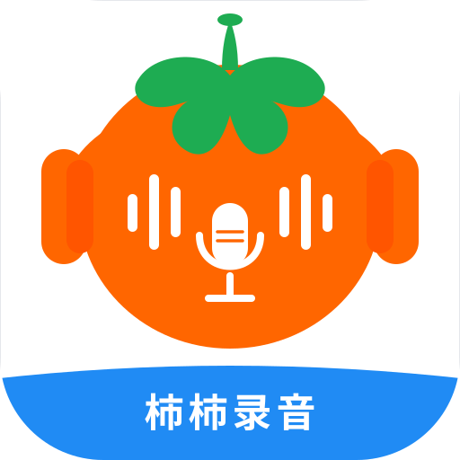

# ShiShiRecorder（柿柿录音）

安卓内部音频 MP3 录音工具。应用只捕获其他应用允许被捕获的播放声音，
不录麦克风、不录屏、不使用摄像头、RTMP、Shizuku 或 Root。



## 使用方法

1. 首次使用时，点击“设置悬浮窗权限”并允许显示在其他应用上层。
2. 在主界面点击“准备录制”。如尚未授权，系统会依次请求录音、通知和
   内部音频捕获权限；在系统弹窗中选择允许的录制范围。
3. 授权完成后只会显示浮窗，尚未开始录音，也不会创建文件。
4. 点击浮窗“开始录制”才开始捕获并编码 MP3；浮窗会变为“停止录制”。
5. 再次点击浮窗“停止录制”，文件会完成写入并显示在本应用的录音列表中。

主界面的“取消准备”以及通知栏的“取消准备”可在尚未开始时关闭浮窗。

## 功能

- 仅 Android 10（API 29）及以上的内部音频捕获。
- 固定 48 kHz、双声道 PCM，使用 LAME 编码为 MP3。
- 码率可选 128 / 192 / 256 / 320 kbps，默认 128 kbps。
- 默认保存到 `Music/MP3`；可通过系统文件夹选择器改用自定义目录。
- 文件名格式为 `yyyy-MM-dd_HH-mm-ss.mp3`。
- 仅展示本应用创建的文件，支持播放、分享、重命名与删除。
- 提供快捷设置磁贴与录音悬浮窗。

## 系统限制

内部音频捕获依赖 Android 的 `AudioPlaybackCapture`。播放应用可自行禁止被
捕获，部分设备厂商也会限制此功能；这些情况下无法录到对应应用的声音。
每次重新“准备录制”都可能出现 Android 的内部音频授权弹窗，这是系统安全
机制，应用无法绕过。

## 构建与发布

本地构建需要 JDK 17、Android SDK 36、NDK `27.0.12077973` 与 CMake `3.22.1`：

```powershell
./gradlew.bat :app:assembleDebug
```

GitHub Actions 会在 `main` 推送和 Pull Request 上执行 debug 构建与 lint。
`Release APK` 工作流可手动运行，也会在推送 `v*` 标签时生成签名 APK 并创建
GitHub Release。

发布签名使用以下 GitHub Secrets，keystore 文件和密码均不提交到仓库：

- `ANDROID_KEYSTORE_BASE64`
- `ANDROID_KEYSTORE_PASSWORD`
- `ANDROID_KEY_ALIAS`
- `ANDROID_KEY_PASSWORD`

## 第三方组件

MP3 编码使用 LAME 3.100。许可证和分发要求见
[THIRD_PARTY_NOTICES.md](THIRD_PARTY_NOTICES.md)。
